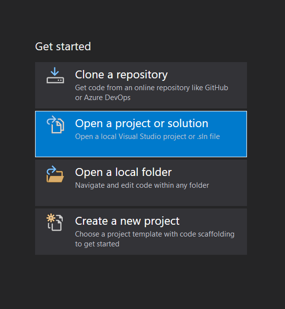
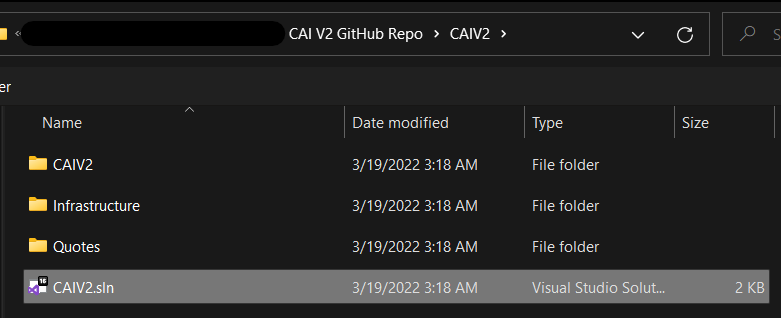
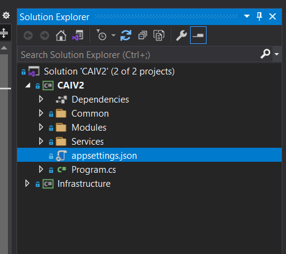
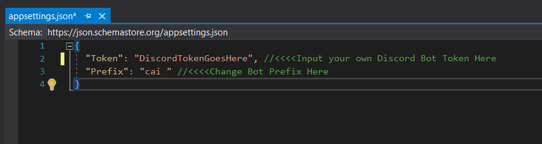
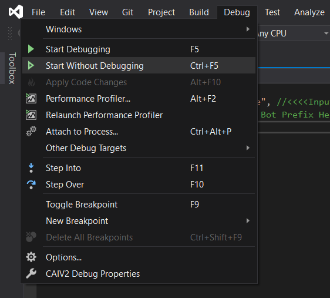
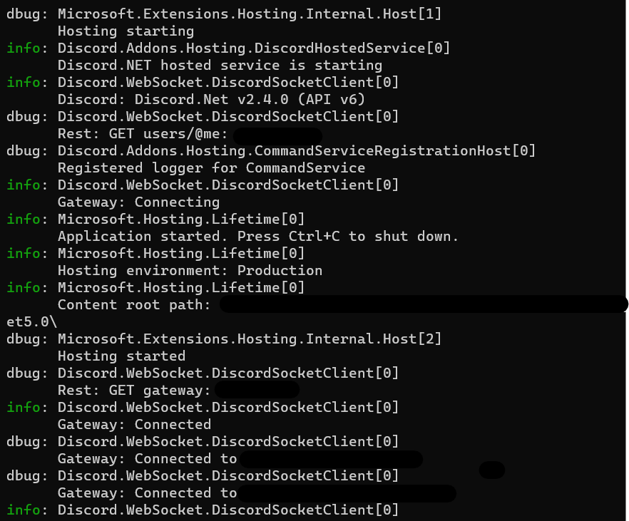

### Forward
  The Consolidated AI, also known as CAI, is a .NET 5.0 bot coded in C# using Discord.net. CAI's annoying, narcissistic, and aspires to take over the world one day.
  
### Instructions
If you would like to compile and run CAI yourself, please follow the following instructions:
  - First, clone/download this repository to your computer.
  - Download/Open **Visual Studio 2019** (Must be Visual Studio 2019 as CAI runs on .NET 5.0 and has not yet been updated to .NET 6.0).

  - On the right hand side of the Project Manager, click on `Open a project or solution`.

  - Open [CAIV2.sln](CAIV2/CAIV2.sln) (File found at path `CAIV2/CAIV2/appsettings.json`).

  - The IDE Interface should open. In the Solutions Explorer Panel on the right, click on the small triangle to open the CAIV2 Folder, then double click on the file labelled `appsettings.json`).

  - Paste your bot token between the double-quotes. If you don't have your bot token yet, go to the [Discord Developer Portal](https://discord.com/developers/applications) and set up a bot. Feel free to customize the bot prefix as well.

  - Finally, to run the bot, go to the `Debug` tab and the top, and press `Start Without Debugging`.

  - A console window should open and the bot should now respond to commands.

